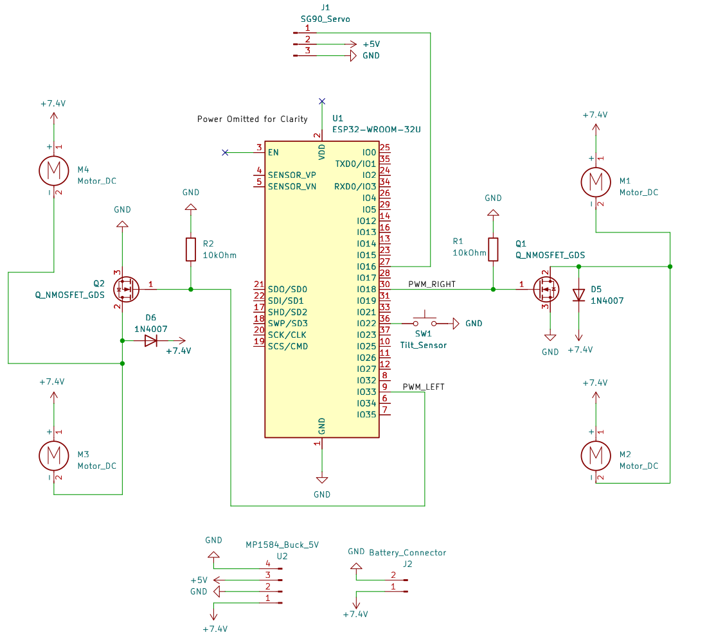

# Flipper Car ROS 2 Workspace

A dual-mode, auto-inverting RC flipper car controlled via ESP32, dual N-channel MOSFETs, a mechanical servo polarity inverter, and ROS 2.

> **⚠️ Project Note & Experimental Design:**  
> The mechanical servo-driven polarity inverter is implemented purely as a fun, educational experiment and mechanical prototyping challenge rather than an industrial standard (such as an integrated solid-state H-bridge). The primary goal of this build is hands-on learning across the full robotics toolchain—combining ROS 2, Micro-ROS, embedded C++, and custom electromechanical design.

---

## 🛠 Features
- **Differential Tank Steering:** Independent Left/Right PWM channels via low-side N-channel MOSFETs.
- **Hardware Polarity Inverter:** Single SG90 servo mechanically swaps motor terminal contacts for bidirectional drive without a full H-bridge.
- **Auto-Flip Inversion:** SW-520D tilt sensor triggers automated reverse compensation and control-remapping when the chassis is flipped upside down.
- **Micro-ROS / ROS 2 Integration:** Teleoperation and status telemetry over WiFi/Serial.

---

## 🕹️ Teleoperation & Controls

| Key | Action | Physical Actuation State |
|---|---|---|
| `W` | Drive Forward | Left: 100% PWM, Right: 100% PWM |
| `Q` | Forward-Left Arc | Left: 50% PWM, Right: 100% PWM |
| `E` | Forward-Right Arc | Left: 100% PWM, Right: 50% PWM |
| `A` | Full Left Pivot | Left: 0% PWM (Locked), Right: 100% PWM |
| `D` | Full Right Pivot | Left: 100% PWM, Right: 0% PWM (Locked) |
| `S` / `Space` | Emergency Stop | Left: 0% PWM, Right: 0% PWM |
| `T` | Toggle Polarity | 200ms Motor Cutoff $\rightarrow$ Servo Sweeps 0° $\leftrightarrow$ 180° |

---

## 🧩 Bill of Materials (Components & Modules)

| Component / Module | Specification / Model | Qty | Description / Role |
|---|---|---|---|
| **Microcontroller** | ESP32 DevKitC V4 (SuooTci / USB) | 1 | Core logic, PWM generation, onboard 3.3V regulation & Micro-ROS communication |
| **DC Motors** | TT Gearbox DC Motors (3V–9V) | 4 | Drive wheels (2x Left, 2x Right wired in parallel pairs) |
| **MOSFETs** | N-Channel Logic-Level (IRLZ44N) | 2 | Low-side speed switching for Left and Right channels |
| **Servo Motor** | SG90 9g Micro Servo | 1 | Actuator for 180° mechanical polarity reversal wiper |
| **Tilt Sensor** | SW-520D Ball Switch | 1 | Detects chassis inversion / rollover state |
| **Flyback Diodes** | 1N4007 | 2 | Inductive spike clamp protection across MOSFET drains |
| **Gate Resistors** | 10 kΩ (1/4W) | 2 | Gate pulldown resistors to prevent startup float |
| **Step-Down Regulator**| MP1584EN Buck Converter | 1 | Steps down 7.4V battery input to 5V rail for servo & logic |
| **Battery Power** | 18650 Li-ion batteries (2S / 7.4V Nominal) | 2 | Main system power source |

---

## 🚀 Getting Started

### Prerequisites
- Ubuntu 22.04 / 24.04
- ROS 2 (Humble / Iron / Jazzy)
- `colcon` build tools

### Build & Run
```bash
# Clone and enter workspace
cd ~/ROS_projects/flipper_car_ws

# Build the packages
colcon build --symlink-install

# Source the overlay
source install/setup.bash

# Run using the startup script
./run.sh
```

## 🔌 Hardware Architecture & Circuit Schematic




> **📌 Schematic Notes & Architecture Disclaimers:**
> - **Mechanical Polarity Inverter Abstraction:** In the schematic above, the DC motors are depicted directly wired to the low-side MOSFET channels for visual clarity. Physical bidirectional control (Forward/Reverse) is achieved via a dedicated SG90 servo mechanical wiper assembly that physically swaps motor terminal contacts by 180°.
> - **ESP32 Board Level Abstraction:** An **ESP32 DevKitC V4** development board is used for the physical build. Onboard power regulation (5V to 3.3V LDO), EN/Boot capacitors, and USB-UART interface are integrated into the dev board and omitted from the component-level schematic for clarity.