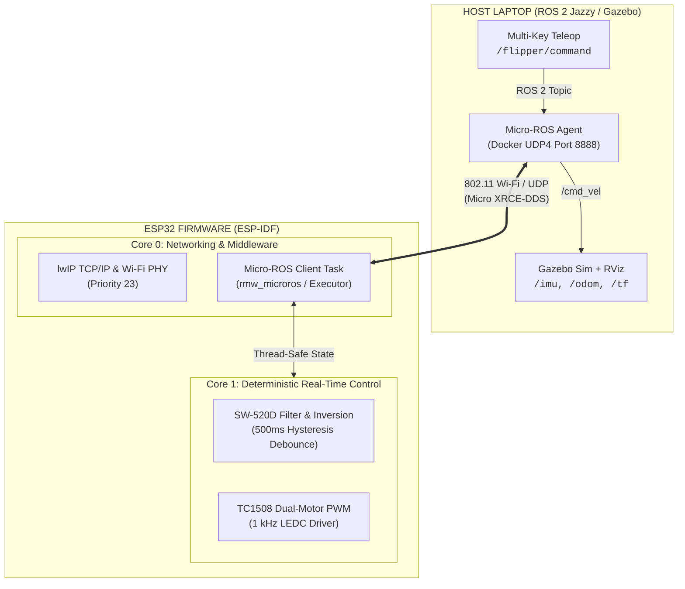
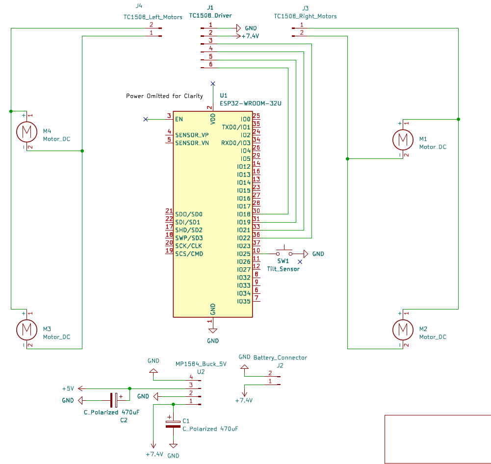

# Flipper Car ROS 2 Workspace

A dual-mode, auto-inverting RC flipper car controlled via ESP32, TC1508 dual H-bridge motor driver, and ROS 2 Jazzy.


> **🛠 Engineering Revision Note (v1.0 → v2.0):**  
> * **v1.0 (Initial Prototype):** Originally designed around discrete low-side N-channel MOSFETs with an experimental SG90 servo-driven mechanical polarity inverter for educational prototyping across the ROS 2 toolchain.  
> * **v2.0 (Current Build):** Upgraded to a dedicated **TC1508 dual H-bridge driver**. The original discrete MOSFETs on hand were standard **`IRFZ44N`** (requiring $V_{GS} \ge 10\text{V}$ for full saturation) rather than logic-level `IRLZ44N` parts. Driving them directly at $3.3\text{V}$ from the ESP32 caused excessive voltage drop and thermal dissipation. Migrating to the TC1508 integrated H-bridge eliminated gate-drive saturation issues, internal flyback diode requirements, and mechanical contact wear while unlocking true zero-radius counter-rotational tank spinning.

---

## 🧩 Bill of Materials (BOM)

### Current Build (v2.0 — Solid-State TC1508 H-Bridge)

| Component / Module | Specification / Model | Qty | Description / Role |
|---|---|---|---|
| **Microcontroller** | ESP32 DevKitC V4 (SuooTci / USB) | 1 | Core logic, FreeRTOS tasks, PWM generation & Micro-ROS bridge |
| **Motor Driver** | TC1508 / MX1508 Dual H-Bridge | 1 | 3.3V logic-compatible dual motor driver ($2.0\text{V} - 9.6\text{V}$, $1.5\text{A}$ peak/ch) |
| **DC Motors** | TT Gearbox DC Motors (3V–9V) | 4 | Drive wheels (2x Left, 2x Right wired in parallel pairs) |
| **Tilt Sensor** | SW-520D Ball Switch | 1 | Detects chassis inversion / rollover state |
| **Power Decoupling Caps**| $470\,\mu\text{F}$ Electrolytic ($\ge 16\text{V}$) | 2 | Bulk filter capacitors (1x on +7.4V battery rail, 1x on +5V logic rail) |
| **Step-Down Regulator**| MP1584EN Buck Converter | 1 | Steps down 7.4V battery input to 5V rail for ESP32 |
| **Battery Power** | 18650 Li-ion cells (2S / 7.4V Nominal) | 2 | Main system power source |

---

### Legacy Prototype (v1.0 — Discrete Gate & Mechanical Polarity Wiper)

| Component / Module | Specification / Model | Qty | Role & Status in Current Build |
|---|---|---|---|
| **Microcontroller** | ESP32 DevKitC V4 | 1 | Retained in v2.0 |
| **DC Motors** | TT Gearbox DC Motors (3V–9V) | 4 | Retained in v2.0 |
| **Step-Down Regulator**| MP1584EN Buck Converter | 1 | Retained in v2.0 |
| **Battery Power** | 18650 Li-ion cells (2S / 7.4V) | 2 | Retained in v2.0 |
| **Tilt Sensor** | SW-520D Ball Switch | 1 | Retained in v2.0 |
| **Power Decoupling Caps**| $470\,\mu\text{F}$ Electrolytic ($\ge 16\text{V}$) | 2 | Retained in v2.0 (Rail decoupling for inductive loads) |
| **MOSFETs** | N-Channel (IRFZ44N) | 2 | **Deprecated:** Standard gate $V_{GS(th)}$ too high for direct 3.3V logic switching. |
| **Servo Motor** | SG90 9g Micro Servo | 1 | **Deprecated:** Mechanical polarity wiper replaced by electronic direction switching. |
| **Flyback Diodes** | 1N4007 | 2 | **Deprecated:** Integrated directly into the TC1508 H-bridge silicon. |
| **Gate Resistors** | 10 kΩ (1/4W) | 2 | **Deprecated:** Unnecessary with driver-level logic inputs. |

---

## 🛠 Features
- **Independent 4-Quadrant Motor Control:** True bidirectional PWM control per side via the TC1508 integrated dual H-bridge.
- **Counter-Rotating Zero-Radius Spins:** Independent forward/reverse driving per track for instant in-place rotation.
- **Auto-Flip Inversion:** SW-520D tilt sensor automatically remaps steering and drive polarities in silicon when the chassis is inverted.
- **Micro-ROS & Native FreeRTOS Integration:** Native ESP-IDF C firmware running micro-ROS (XRCE-DDS) directly over UDP/Wi-Fi to ROS 2 Jazzy.
- **Verified Hardware-in-the-Loop (HIL):** ESP32 silicon executing all kinematic translations, roll inversion math, and closed-loop `/cmd_vel` generation controlling Gazebo/RViz in real time.

---

## 🏗️ Architecture & Dual-Core Execution Model



## 🕹️ Teleoperation & Controls

| Key Binding | Action | Actuation Behavior / Setpoint |
|---|---|---|
| `W` / `S` | Drive Forward / Reverse | Both tracks drive symmetrically at active gear speed |
| `A` / `D` | Zero-Radius Tank Spin | Left & right tracks counter-rotate symmetrically |
| `W + A` / `W + D` | Sharp Forward Curves | Outer track at full gear speed; inner track at 35% power |
| `S + A` / `S + D` | Sharp Reverse Curves | Outer track at -100% gear speed; inner track at -35% power |
| *(Release All)* | Auto Coast / Stop | Motors silenced (`0% PWM`) |
| `1` | Gear 1 (Precision / Crawl) | Scaled to **55% PWM** (Deadband compensation) |
| `2` | Gear 2 (Cruise / Street) | Scaled to **75% PWM** |
| `3` | Gear 3 (Turbo / Full) | Scaled to **100% PWM** |

---

## ⚡ Hardware Pinout (ESP32)

| Component Pin | ESP32 GPIO | Peripheral / Channel | Function / Configuration |
|---|---|---|---|
| **TC1508 `INA` (`IN1`)** | `GPIO 19` | `LEDC_CHANNEL_0` | Motor A Left Inverted Forward |
| **TC1508 `INB` (`IN2`)** | `GPIO 18` | `LEDC_CHANNEL_1` | Motor A Left Inverted Reverse |
| **TC1508 `INC` (`IN3`)** | `GPIO 22` | `LEDC_CHANNEL_2` | Motor B Right Forward |
| **TC1508 `IND` (`IN4`)** | `GPIO 23` | `LEDC_CHANNEL_3` | Motor B Right Reverse |
| **SW-520D Tilt Sensor** | `GPIO 4` | GPIO Input | Inversion Detection (`INPUT_PULLUP`) |


---

## 🚀 Getting Started

### Prerequisites
- Ubuntu 22.04 / 24.04
- ROS 2 (Jazzy / Humble)
- ESP-IDF v5.2+
- Docker (for micro-ROS agent)

### Build & Run
```bash
# Clone and enter workspace
cd ~/ROS_projects/flipper_car_ws

# Build the packages
colcon build --symlink-install

# Source the overlay
source install/setup.bash

# Run using the startup script
./run.sh

# Source ESP-IDF environment (v5.2+)
. $HOME/esp/esp-idf/export.sh

# Navigate to firmware project
cd ~/ROS_projects/flipper_car_ws/firmware/flipper_firmware

# Build, flash to ESP32, and start UART serial monitor
idf.py build flash monitor

docker run -it --rm --net=host microros/micro-ros-agent:jazzy udp4 --port 8888

d ~/ROS_projects/flipper_car_ws
./run.sh
```

## 🔌 Hardware Architecture & Circuit Schematic



> **📌 Schematic Notes:**
> * **Driver Integration:** The TC1508 features integrated internal flyback clamping diodes, eliminating the need for external discrete `1N4007` diodes.
> * **Power Decoupling:** A $470\,\mu\text{F}$ capacitor is tied directly across the battery $+7.4\text{V}$ and $\text{GND}$ rails close to the TC1508 to prevent inductive brownouts on the ESP32.
> * **ESP32 Board-Level Abstraction:** An **ESP32 DevKitC V4** development board is used for the physical build. Onboard power regulation (5V to 3.3V LDO), EN/Boot pull-ups/capacitors, and the USB-UART interface are integrated on the board and omitted from the component-level schematic for clarity.